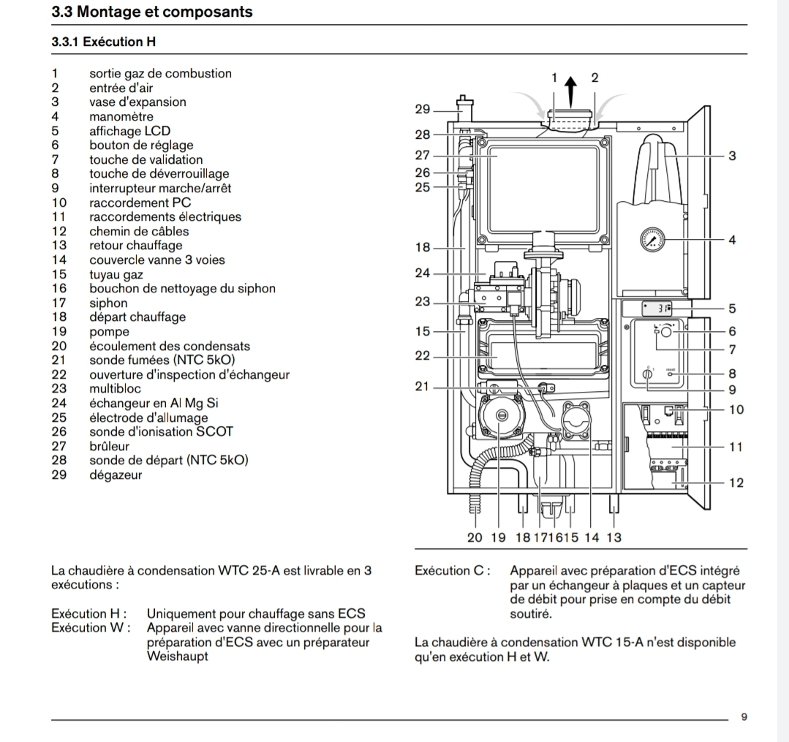
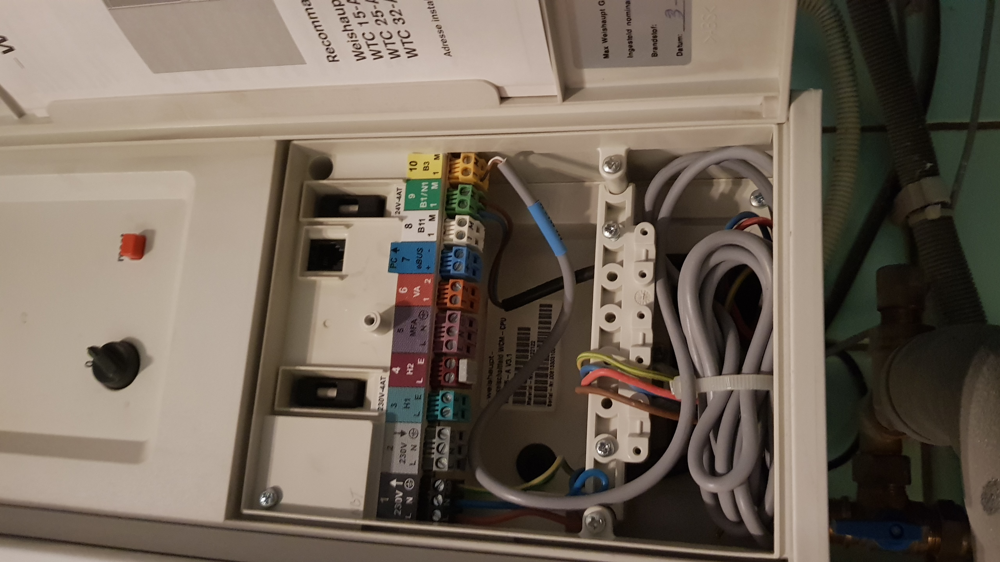
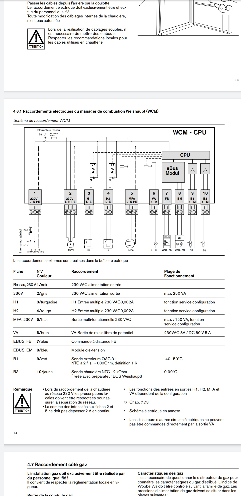
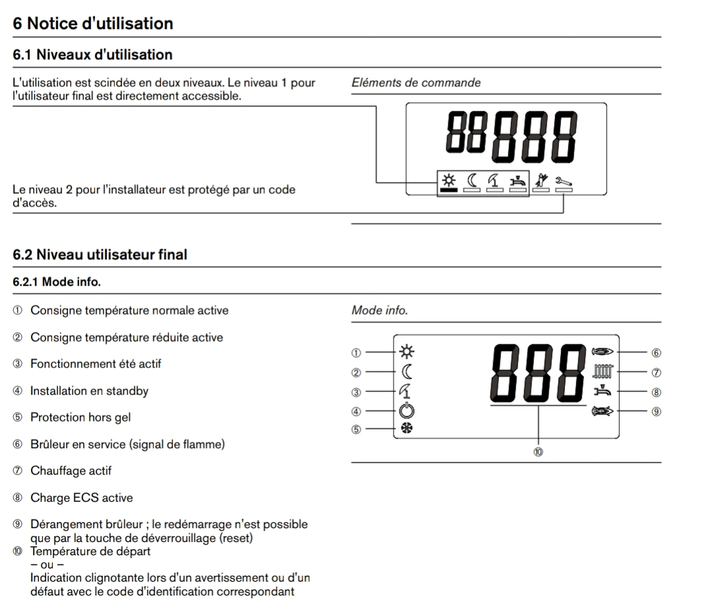
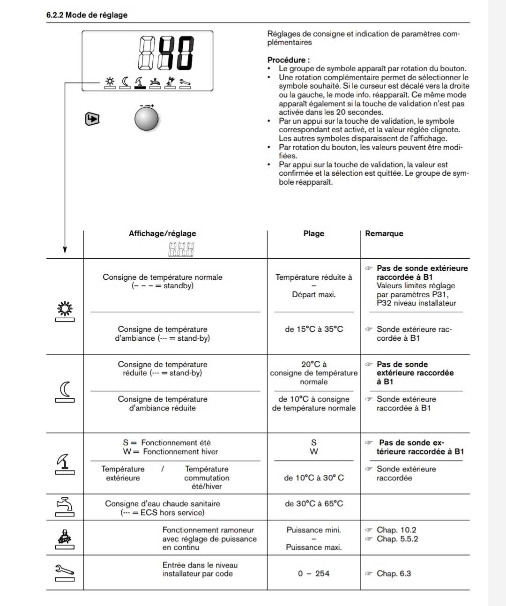
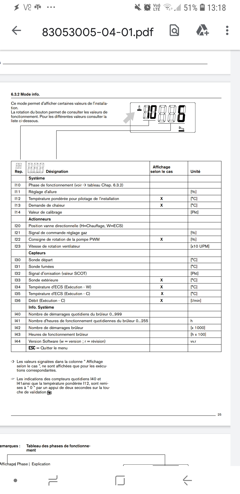
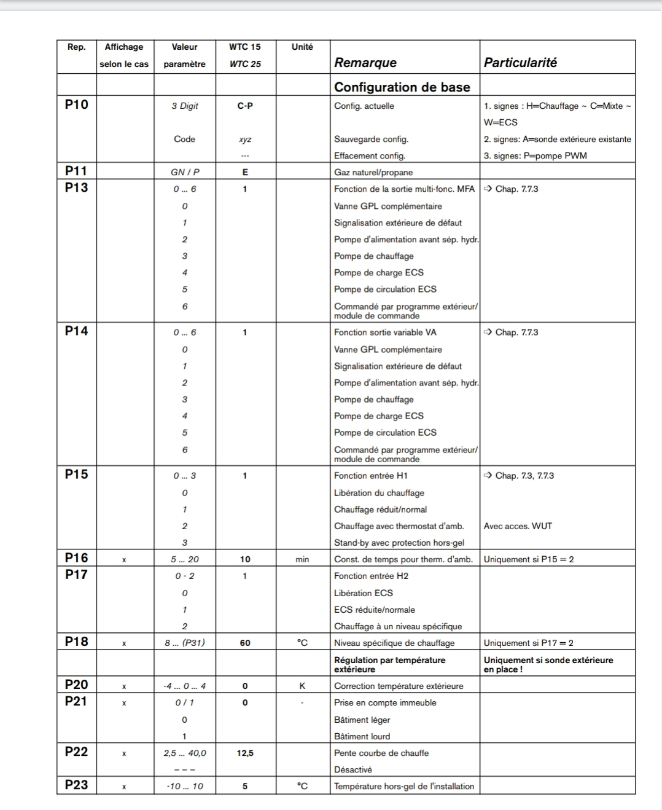
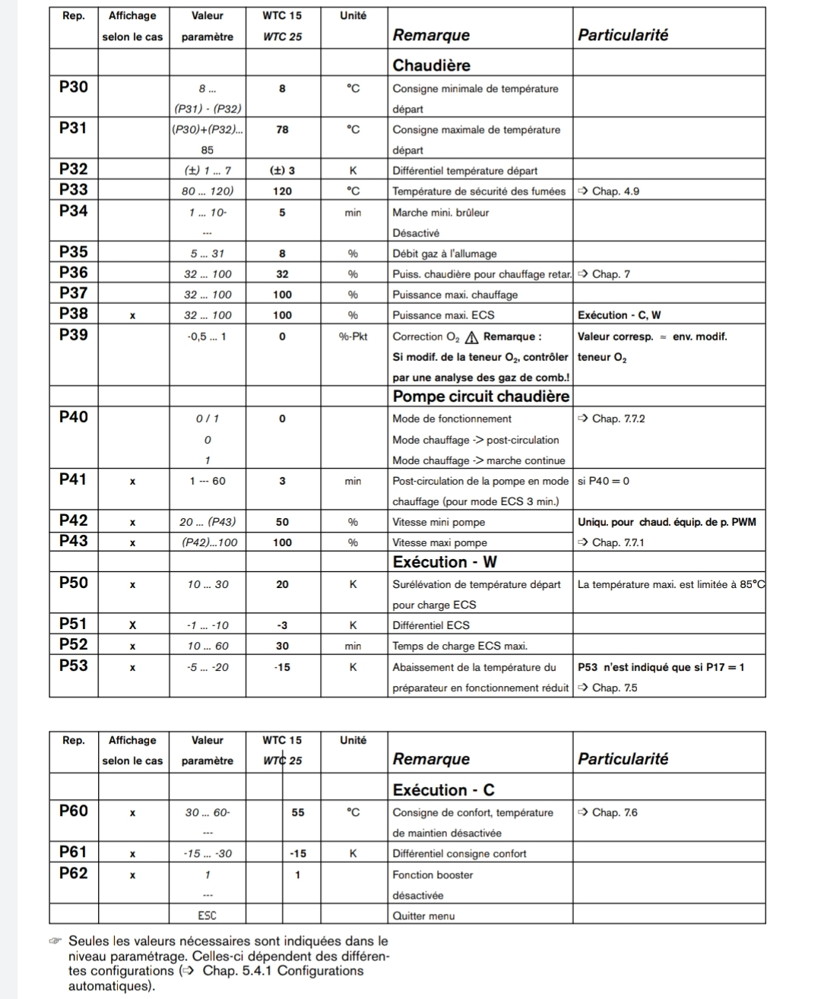

# Weishaupt  WAS 25A

# panou conducte

# panou technic

- Sonde B1 - fir negru se duce undeva in centrala
- Sonde B3 - temperatura Boiler
- Sonde exterieure - Raccordement d'une QAC 31 à la fiche B1

# panou reglage

# info

# programs

# Errors

W14 - temp max depasita de 100 gr?!

# Parametri si Caldura

# C01
| Param         | Value   |
|--------------|-----------|
| P15 | 0      |
| P17      | 0 |
| P20 | 0 |
| P22 | 12.5 |
| P23 | 5 |
| P30 | 10 |
| P31 | 70 |
| P32 | 5 |
| P34 | 5 |
| P35 | 8 |
| P36 | 32 |
| P37 | 90 |
|P38 | 90 |
| P40| 0 |
| P41| 2 |
| P42|30|
|P43|70|
|P45|60|
|P50|20|
|P51|-3|
|P52|30|
|P70|300|
|P72|-0.5|
